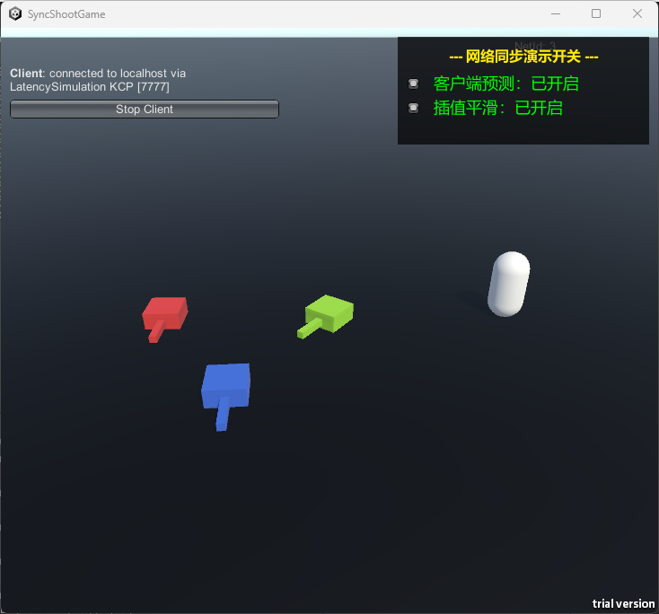

# SyncShootGame




---

## 📖 项目简介

本项目是一款基于 Unity + Mirror 网络框架开发的多人俯视角射击游戏原型，核心研究目标是在弱网环境（高延迟 > 200ms、高丢包 > 5%）下，通过**客户端预测、服务器和解、插值平滑**三套协同机制，解决传统"服务端权威"模式带来的角色拉扯、操作迟滞等体验问题。

---

## 🎯 核心技术亮点

### 三大同步机制

| 机制 | 作用 | 效果 |
|------|------|------|
| 客户端预测（Client-side Prediction） | 本地即时执行输入，不等服务端回包 | 操作响应延迟 ≤ 16ms |
| 服务器和解（Server Reconciliation） | 收到权威状态后回滚并重演未确认输入 | 保证最终一致性 |
| 插值平滑（Interpolation Smoothing） | 接收端对远端实体做指数平滑渲染 | 视觉抖动 ≤ 1 像素 |

### 工程解决的三个具体问题

1. **Host 模式和解位置抖动**：Mirror 环回延迟几乎为 0，对 Host 身份特判跳过和解流程
2. **Windows 后台帧节流 Tick 爆帧**：TickManager 限制单帧最大补偿 Tick 数，丢弃超额积压
3. **线性插值高抖动下效果差**：替换为指数平滑插值，自适应吸收网络抖动

---

## 🏗️ 系统架构

```
输入采集 (GatherInput)
    │
    ▼
客户端预测 (ApplyInputLocally)     ←── 本地即时响应
    │
    ▼
发送到服务端 (SendInputToServer)
    │
    ▼
服务端仲裁 (GameNetworkManager)
    │
    ▼
广播权威状态 (ServerStateMessage)
    │
    ├──► 本地玩家：服务器和解 + 重演未确认输入
    └──► 远端玩家：指数平滑插值渲染
```

---

## 📁 核心文件说明

```
Assets/Scripts/
├── Network/
│   ├── GameNetworkManager.cs    # 网络管理器，服务端仲裁中心
│   └── NetworkMessages.cs       # 网络消息数据结构定义
├── Player/
│   ├── SyncPlayerController.cs  # 核心同步控制器（预测/和解/插值）
│   └── NetworkPlayer.cs         # 网络玩家基础组件
├── Core/
│   └── TickManager.cs           # 固定逻辑帧管理器（30Hz）
└── UI/
    └── DebugToggleUI.cs         # 演示开关面板（预测/插值实时切换）
```

---

## ⚙️ 弱网测试场景

项目集成 Mirror `LatencySimulation` 传输层，支持实时模拟弱网环境：

| 场景 | Latency | Jitter | 对应 RTT |
|------|---------|--------|---------|
| 理想网络 | 0ms | 0ms | ≈ 0ms |
| 轻度弱网 | 50ms | 20ms | ≈ 100ms |
| 中度弱网 | 100ms | 30ms | ≈ 200ms |
| 重度弱网 | 200ms | 60ms | ≈ 400ms |
| 极端弱网 | 250ms | 80ms | ≈ 500ms |

---

## 🚀 运行方式

### 环境要求

- Unity 2022.3 LTS
- Mirror Networking（已包含在项目中）

### 启动步骤

1. 克隆仓库，用 Unity 打开项目
2. 打开场景 `Assets/Scenes/GameScene`
3. 点击 Play，点击 **Start Host** 启动服务端
4. 构建一个客户端 Build 或使用 ParrelSync 启动第二个实例
5. 客户端点击 **Start Client** 连接

### 演示开关

运行后右上角面板可实时切换：
- **客户端预测**：关闭后本地操作有明显延迟感
- **插值平滑**：关闭后远端玩家出现位置跳变

---

## 📊 性能指标

| 指标 | 目标值 | 实现结果 |
|------|--------|---------|
| 本地输入响应延迟 | ≤ 16ms | ✅ 即时响应 |
| 视觉抖动幅度 | ≤ 1 像素 | ✅ 指数平滑覆盖 |
| 逻辑回滚失败率 | ≤ 0.3% | ✅ Host特判保障 |

---

## 🛠️ 技术栈

- **引擎**：Unity 2022.3
- **网络框架**：Mirror + KCP Transport
- **同步策略**：状态同步（State Sync）
- **语言**：C#
- **版本控制**：Git / GitHub

---
